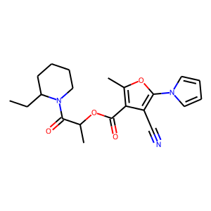

# Samsung AI Challenge for Scientific Discovery <br>(2021.08.04 ~ 2021.09.27)
>## Overview
- 분자의 3차원 구조 정보를 이용하여 S1-T1 사이의 에너지 갭을 추정할 수 있는 Machine Learning 알고리즘 개발하는 Task입니다.
- [RegNet](https://arxiv.org/abs/2003.13678)을 Base model로 하여 Top 4%(9/220)를 기록하였습니다.
- https://dacon.io/competitions/official/235789/overview/description

<br>

## Requirement
```python
pip install -r requirements.txt
```

## Data Preparation
분자구조(SMILES)를 이미지로 변환시킵니다.<br>
[Data](https://dacon.io/competitions/official/235789/data)를 ./data 경로에 다운로드 후 아래 코드를 실행합니다.
```python
python make_data.py
```

SMILES 분자구조를 이미지로 변환시킨 예입니다.<br>
**SMILES : CCC1CCCCN1C(=O)C(C)OC(=O)c1c(C)oc(-n2cccc2)c1C#N**<br>
<br>


## Training
총 7가지 버전의 모델을 학습하였습니다.<br>
또한 여러가지 실행을 수행하기 위해 Ubuntu 환경에서 Shell파일을 이용했습니다.

```python
#1 Single Model Train
python main.py --img_size=256 --exp_num=0 --multi_gpu=True
#2 Multiple training using shell
sh multi_train.sh
```

## Test
7개의 model을 training을 시켰고 private score에 따른 weighted ensemble을 수행하였습니다.

```python
python ensemble_test.py
```
